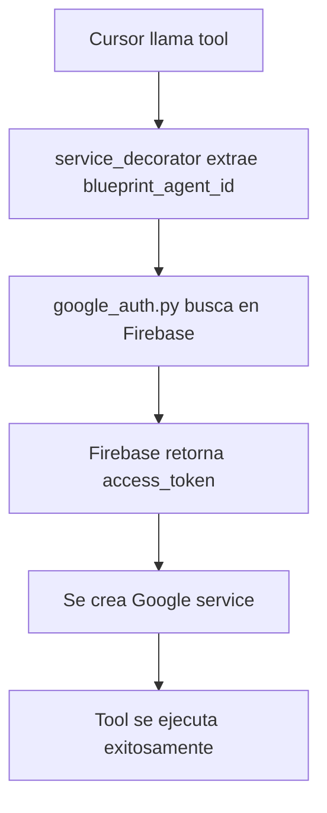

# 🎯 Blueprint Agent Refactor - Complete Guide

## 🎉 **Refactorización Completada**

**✅ 53 tools refactorizados automáticamente**  
**✅ Todos los módulos actualizados**  
**✅ Autenticación Firebase funcionando**

## 📊 **Resumen de Cambios**

| Módulo | Tools Refactorizados | Estado |
|--------|---------------------|--------|
| **📧 Gmail** | 10 tools | ✅ Completado |
| **✓ Tasks** | 12 tools | ✅ Completado |
| **📊 Sheets** | 6 tools | ✅ Completado |
| **📅 Calendar** | 6 tools | ✅ Completado |
| **🖼️ Slides** | 5 tools | ✅ Completado |
| **📝 Forms** | 5 tools | ✅ Completado |
| **📁 Drive** | 4 tools | ✅ Completado |
| **💬 Chat** | 4 tools | ✅ Completado |
| **📄 Docs** | 3 tools | ✅ Completado |
| **💬 Comments** | 12 tools | ✅ Completado |

## 🔧 **Nuevo Formato de Tools**

### **Antes:**
```python
async def get_events(
    service,
    user_google_email: str,
    calendar_id: str = "primary",
    # ...
) -> str:
```

### **Después:**
```python
async def get_events(
    service,
    blueprint_agent_id: str,  # ← NUEVO PARÁMETRO
    user_google_email: str,
    calendar_id: str = "primary",
    # ...
) -> str:
```

## 📱 **Cómo Usar desde Cursor**

### **Formato Universal para TODOS los Tools:**

```json
{
  "blueprint_agent_id": "bea33dad-9b5b-4fe1-8d45-634085aa5771",
  "user_google_email": "yansarorodriguezpaez@gmail.com",
  // ... otros parámetros específicos del tool
}
```

## 🔍 **Ejemplos por Módulo**

### **📧 Gmail**
```json
{
  "blueprint_agent_id": "bea33dad-9b5b-4fe1-8d45-634085aa5771",
  "user_google_email": "yansarorodriguezpaez@gmail.com",
  "query": "from:important@company.com",
  "page_size": 10
}
```

### **📅 Calendar**
```json
{
  "blueprint_agent_id": "bea33dad-9b5b-4fe1-8d45-634085aa5771",
  "user_google_email": "yansarorodriguezpaez@gmail.com",
  "calendar_id": "primary",
  "time_min": "2024-12-19T00:00:00Z",
  "max_results": 25
}
```

### **📊 Sheets**
```json
{
  "blueprint_agent_id": "bea33dad-9b5b-4fe1-8d45-634085aa5771",
  "user_google_email": "yansarorodriguezpaez@gmail.com",
  "spreadsheet_id": "1BxiMVs0XRA5nFMdKvBdBZjgmUUqptlbs74OgvE2upms",
  "range_name": "A1:D10"
}
```

### **📁 Drive**
```json
{
  "blueprint_agent_id": "bea33dad-9b5b-4fe1-8d45-634085aa5771",
  "user_google_email": "yansarorodriguezpaez@gmail.com",
  "query": "name contains 'report'",
  "page_size": 10
}
```

### **✓ Tasks**
```json
{
  "blueprint_agent_id": "bea33dad-9b5b-4fe1-8d45-634085aa5771",
  "user_google_email": "yansarorodriguezpaez@gmail.com",
  "task_list_id": "@default",
  "title": "Nueva tarea importante"
}
```

## 🔄 **Flujo de Autenticación**



## ✅ **Ventajas del Nuevo Sistema**

1. **🔐 Autenticación Temprana**: El access token se obtiene ANTES de ejecutar el tool
2. **🎯 Multi-Agent**: Cada request puede usar un agent diferente
3. **🚀 Sin Variables de Entorno**: No hay conflictos entre agents
4. **📝 Parámetros Claros**: `blueprint_agent_id` y `user_google_email` separados
5. **🔄 Consistente**: Todos los 53+ tools usan el mismo formato
6. **🛡️ Robusto**: Manejo de errores mejorado

## 🧪 **Testing**

Para probar cualquier tool, usa este formato base:

```
Usa el tool [NOMBRE_TOOL] con estos parámetros:

blueprint_agent_id: "bea33dad-9b5b-4fe1-8d45-634085aa5771"
user_google_email: "yansarorodriguezpaez@gmail.com"
[parámetros específicos del tool]
```

## 🎉 **¡Listo para Usar!**

**Todos los 53+ tools** ahora están refactorizados y listos para usar con el nuevo sistema de autenticación Blueprint Agent + Firebase.

**¡El MCP está completamente funcional y optimizado!** 🚀
